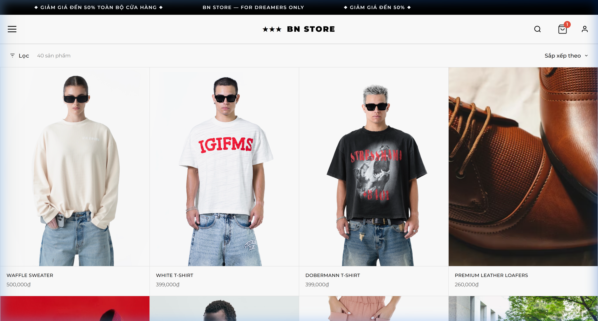
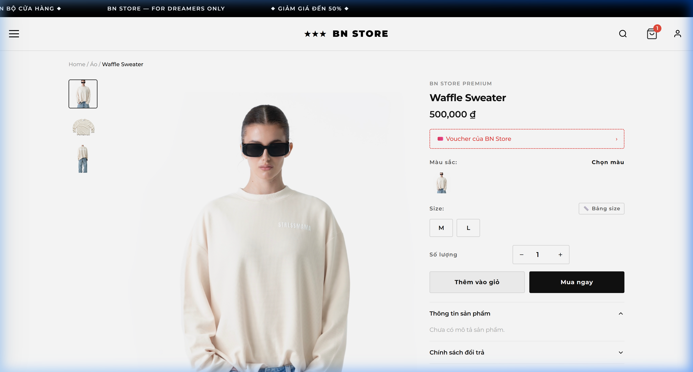
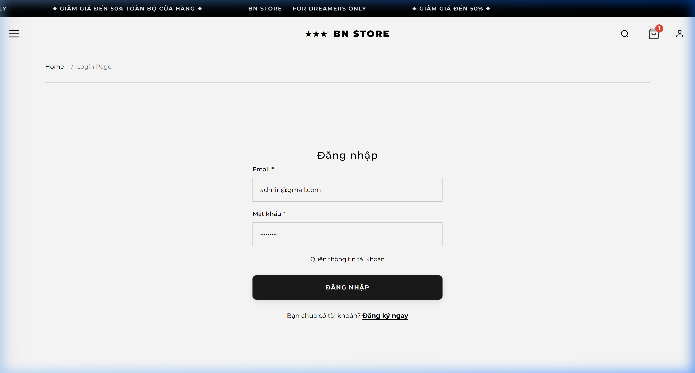

# 🌟 BN STORE - FashionStoreIS E-Commerce System

BN STORE (FashionStoreIS) là một hềEthống thương mại điện tử chuyên biệt được xây dựng trên nền tảng **ASP.NET Core MVC** (.NET 8.0). Dự án vận dụng kiến trúc **Clean Code & Monolith Optimization**, đi kèm giao diện phong cách Minimalism tối giản, tập trung tuyệt đối vào trải nghiệm thềEgiác và trải nghiệm mua sắm của Khách hàng.

HềEthống được thiết kế đềEgiải quyết trọn vẹn vòng đời mua sắm: Từ khi duyệt danh mục (Mega Catalog), xem chi tiết sản phẩm, quản lý GiềEhàng, Đặt hàng chống xuất trùng (Concurrency Control), đến tự động hóa quản trềETồn kho và Voucher.

---

## 📸 Giao diện màn hình chính (Screenshots)

### 1. Hero Banner Trang Chủ (Minimalist Homepage)
Sử dụng AI-Generated Graphics cùng Navigation Bar trong suốt mang lại cảm giác thời trang cao cấp. 
<br>


### 2. Danh Mục Sản Phẩm (Mega Catalog Grid)
Product Grid 4-cột, khoảng cách viền tiêu chuẩn. Thanh Sort/Filter dạng Sticky-top dính trơn tru. BềElọc hoạt động bằng Ajax siêu tốc đềE không phải reload toàn trang.
<br>


### 3. Trang Chi Tiết Sản Phẩm (Product Detail Page)
HềEtrợ đầy đủ biến thềEMàu sắc & Kích cỡ (Color/Size). Tích hợp thuật toán chặn đúp chuột (JS Loading Spinner) đềEngăn User vô tình tạo spam trong giềEhàng.
<br>


### 4. Thành viên & Bảo mật (User Security Identity)
Xây dựng trên nền tảng ASP.NET Identity tương thích 100% với Oracle 11g. Tích hợp lớp "Trạm kiểm soát" bảo mật (Magic Bytes Validation) kiểm tra mã Hex đềEchặn mã độc ngụy trang ảnh trong quá trình đổi Avatar.
<br>


---

## 🚀 Các Tính Năng Kỹ Thuật Nổi Bật (Key Features)

### 1. Giao diện Cửa Hàng Hiện Đại (Storefront UI/UX)
- **Thiết kế Tối Giản (Minimalism)**: Product Grid mượt mà 4-cột, kết hợp ảnh Placeholder đềEphân giải cao do AI Generate.
- **Mobile-First Navigation**: Hamburger Drawer Menu với Submenu Drop-down (Accordion) tích hợp Search ẩn tinh tế.
- **BềELọc Động (Dynamic Filtering)**: Filter đa chiều (Category, Giá, Keyword) + Phân trang Ajax xịn xò.
- **Bảng Điều Khiển Khách Hàng (User Profile)**: Redesign lại UI ngang chuyên nghiệp giống Shopee/Lazada với tính năng **Người dùng tự thao tác Hủy đơn**.

### 2. Xử Lý Luồng Nghiệp Vụ Chặt Chẽ (Business Logic)
- **Tránh Xung Đột Thanh Toán (Optimistic Concurrency)**: Sử dụng kỹ thuật cấp phát Byte `RowVersion` cho bảng `ProductSkus` đềEchốt chặn Race Condition (2 khách mua cùng 1 áo cuối cùng vào cùng 1 mini-sec).
- **Phục hồi Tài Nguyên (Resource Restoration)**: Tích hợp thuật toán nhả Tồn kho (`Stock`) và Lượt áp Voucher tự động ngay khi khách hàng chủ động bấm lệnh Hủy Đơn trên Profile (đối với hàng Pending).
- **Phân Khối Ảnh An Toàn (Magic Bytes Validation)**: Cơ chế quét trực tiếp cấu trúc Hex Headers (khối 12 byte đầu) của Tệp upload đềEphân biệt chính xác ảnh thật (JPG/PNG/WEBP) và tệp tin mã độc ngụy trang.

### 3. Ngõ ra Trung Tâm Dữ Liệu (Data Warehouse Endpoint)
- Xây dựng DB riêng biệt cho HềEphân tích (`analytics.db` - SQLite) bằng kiến trúc **Star Schema** (Fact & Dimensions). Đoạn mã ngầm (Worker/HostedService/Cronjob) sẽ tự động đồng bềE(ETL Data) từ Oracle qua SQLite phục vụ PowerBI.

---

## 🛠 Nền Tảng Công NghềE(Tech Stack)
- **Framework:** .NET 8.0, ASP.NET Core MVC
- **Database Chính (OLTP):** Oracle 11g Express Edition / Enterprise (Oracle.EntityFrameworkCore)
- **Database Phân tích (OLAP):** SQLite (Entity Framework Core)
- **Front-end:** HTML5, CSS3, JavaScript (jQuery AJAX), Bootstrap 5, FontAwesome 6, Google Fonts.
- **ORMs:** Entity Framework Core (Code-First Migrations).

---

## ⚁EHướng dẫn Cài đặt & Khởi chạy (Setup Guide)

1. **Yêu Cầu Môi Trường:**
   - .NET 8 SDK
   - Oracle Database 11g (XE hoặc EE) chạy cổng 1521. Schema mặc định (hoặc điều chỉnh tại `appsettings.json`).

2. **Cấu hình Connection Strings (appsettings.json):**
   ```json
   "ConnectionStrings": {
     "DefaultConnection": "Data Source=(DESCRIPTION=(ADDRESS=(PROTOCOL=TCP)(HOST=localhost)(PORT=1521))(CONNECT_DATA=(SERVICE_NAME=XE)));User Id=C##USER;Password=PASSWORD;",
     "AnalyticsConnection": "Data Source=analytics.db"
   }
   ```

3. **Tạo Database & Seeding Data:**
   - MềETerminal (PowerShell/CMD) tại thư mục chứa file `.csproj`
   - Khởi tạo Database lệnh CLI:
     ```bash
     dotnet ef database update
     ```
   - *Tính Năng Seeder*: Lớp `DbInitializer` sẽ tự động tiêm hàng chục sản phẩm mẫu từ DB Dummy, Tái tạo Role/User (`admin@bnstore.vn`) trong lần đầu Load hềEthống.

4. **Kích Hoạt Project:**
   ```bash
   dotnet run
   ```
   *Truy vấn localhost thông qua Google Chrome đềEtrải nghiệm toàn vẹn luồng Web-Shopping đẳng cấp này.* 🚀

